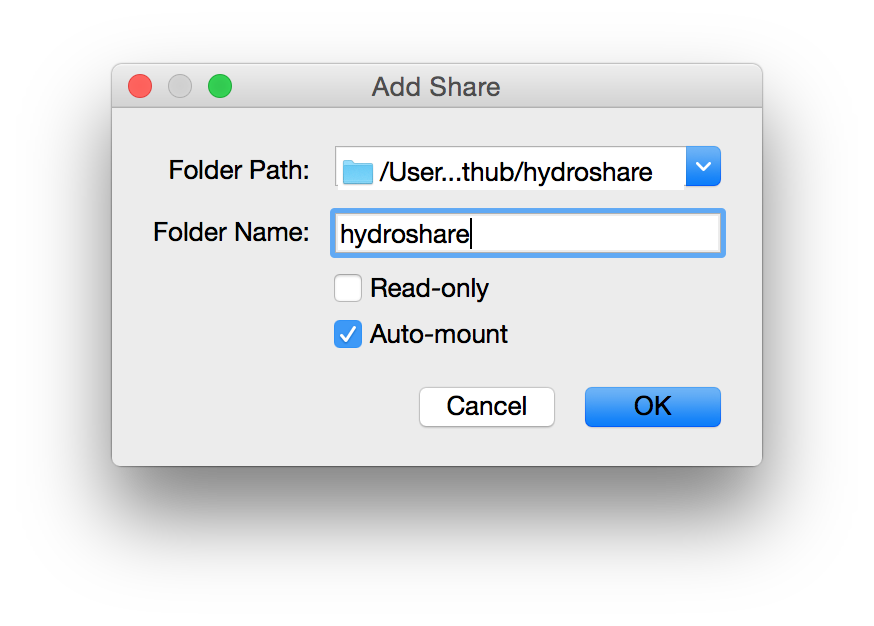

# Getting Started

The HydroShare code is meant to be run by developers in a local Linux development environment making use of [Docker](https://docs.docker.com) and [docker-compose](https://docs.docker.com/compose/install/).

A predefined Xubuntu image has been created in [VirtualBox](https://www.virtualbox.org) and is available for download here: [hydrodev-xubuntu-MM-DD-YYYY-vbox.ova](http://distribution.hydroshare.org/public_html/). 

- Use the most recent MM-DD-YYY image if there are multiples listed
- This image is updated from time to time, but it is the developer's responsibility to keep the VM in good running order once they've installed it locally.

The **hydrodev** VM is distributed as a *VirtualBox Appliance* and can be installed by choosing `File > Import Appliance` from the VirtualBox menu.

A predefined user named `hydro` with sudo rights has been designated as the default user.

- User: **hydro**
- Password: **hydro**

## Running HydroShare

The hydroshare code is configured with the assumption that the developer is using the **hydrodev** VM and will be operating as user **hydro** from the `/home/hydro` directory.

A new installation would first require the cloning of the hydroshare repository.

```bash
hydro@hydro-VirtualBox:~$ cd /home/hydro/
hydro@hydro-VirtualBox:~$ git clone https://github.com/hydroshare/hydroshare.git
Cloning into 'hydroshare'...
remote: Counting objects: 15029, done.
remote: Compressing objects: 100% (169/169), done.
remote: Total 15029 (delta 76), reused 0 (delta 0), pack-reused 14856
Receiving objects: 100% (15029/15029), 50.64 MiB | 27.23 MiB/s, done.
Resolving deltas: 100% (10077/10077), done.
Checking connectivity... done.
hydro@hydro-VirtualBox:~$ cd hydroshare/
```
The developer should base any work they do from the develop branch as follows.

```bash
hydro@hydro-VirtualBox:~/hydroshare$ git checkout develop
Branch develop set up to track remote branch develop from origin.
Switched to a new branch 'develop'
hydro@hydro-VirtualBox:~/hydroshare$ git checkout -b 123-my-development-branch
Switched to a new branch '123-my-development-branch'
```
At this point the developer could deploy the base hydroshare code in hydrodev using the `hsctl` script.

```bash
hydro@hydro-VirtualBox:~/hydroshare$ ./hsctl deploy
...
Operations to perform:
  Synchronize unmigrated apps: debug_toolbar, galleries, irods_browser_app, accounts, conf, rest_framework, forms, gis, generic, boot, comments, blog, jquery_ui, crispy_forms, core, hs_metrics, filebrowser_safe, sitemaps, pages, mobile, autocomplete_light, djcelery, widget_tweaks, django_extensions
  Apply all migrations: redirects, ref_ts, sessions, admin, hs_swat_modelinstance, hs_model_program, sites, auth, hs_geo_raster_resource, theme, contenttypes, hs_tools_resource, ga_resources, hs_app_netCDF, hs_core, django_docker_processes, ga_ows, django_irods, hs_modelinstance, hs_app_timeseries
Synchronizing apps without migrations:
  Creating tables...
  Installing custom SQL...
  Installing indexes...
Running migrations:
  No migrations to apply.
```

When the build is finished the developer would be able to access the running hydroshare site at [http://localhost:8000/](http://localhost:8000/)

A single administrative user is included with the django deployment of HydroShare.

- username: **admin**
- password: **default**

### hsctl

The supplied HydroShare Control script named `hsctl` has been created to provide the most common deployment methods that a developer would use.

```bash
hydro@hydro-VirtualBox:~/hydroshare$ ./hsctl --help
*** HydroShare Control script ***
usage: ./hsctl deploy      # deletes all database and container contents and deploys from scratch
usage: ./hsctl loaddb      # loads database specified in hydroshare-config.yaml into running container
usage: ./hsctl rebuild     # deletes hydroshare container contents only and deploys using exsiting database
usage: ./hsctl restart     # restarts the hydroshare container without rebuilding
usage: ./hsctl start       # attempts to start all containers
usage: ./hsctl stop        # stops all running containers
```

Functionality

- **deploy:** Fully stops, removes and deletes any prior hydroshare docker containers, images and database contents prior to installing a clean copy of the hydroshare codebase as defined in the `hydroshare-config.yaml` file
- **loaddb:** Deletes existing database and reloads the database specified in the `hydroshare-config.yaml` file.
- **rebuild:** Stops, removes and deletes only the hydroshare docker containers and images while retaining the database contents on the subsequent build as defined in the `hydroshare-config.yaml` file
- **restart:** Restarts the django server only (and nginx if applicable).
- **start:** Starts all containers as defined in the `docker-compose.yml` file (and nginx if applicable).
- **stop:** Stops all containers as defined in the `docker-compose.yml` file.

### hydroshare-config.yaml

Located at `config/hydroshare-config.yaml` this file defines the local development environment and how the application should be run.

```yaml
### Local Configuration Variables ###
HS_PATH: /home/hydro/hydroshare
HOST_SSL_DIR: /home/hydro/hs-certs
HS_DATABASE: pg.development.sql

### Deployment Options ###
USE_NGINX: false
USE_SSL: false

### nginx Configuration Variables ###
FQDN_OR_IP: localhost
NGINX_DIR: /home/hydro/hydroshare/nginx

### SSL Configuration Variables ###
SSL_CERT_DIR: /home/hydro/hydroshare/nginx/cert-files
SSL_CERT_FILE: hydrodev-vb.example.org.cert
SSL_KEY_FILE: hydrodev-vb.example.org.key
```

Meaning of each entry:

**Local Configuration Variables**

- HS_PATH: Location of the hydroshare repository in development environment (default is `/home/hydro/hydroshare`).
- HOST_SSL_DIR: Location of SSL certificate files in the local environment (default is `/home/hydro/hs-certs`).
- HS_DATABASE: Which database to use for **deploy** or **loaddb** calls (default is `pg.development.sql`).

**Deployment Options**

- USE_NGINX: Use ngninx server to serve hydroshare files **true** or **false** (default is `false`)
- USE_SSL: Use SSL certificates to serve hydroshare application **true** or **false** (default is `false`)

**nginx Configuration Variables**

- FQDN_OR_IP: Fully Qualified Domain Name or IP Address of where the hydroshare application is served at (default is `localhost`)
- NGINX_DIR: Location of the nginx directory in development environment (default is `/home/hydro/hydroshare/nginx`)

**SSL Configuration Variables**

- SSL_CERT_DIR: Location of the self generated SSL certificate files directory in development environment (default is `/home/hydro/hydroshare/nginx/cert-files`)
- SSL_CERT_FILE: SSL cert file name (default is `hydrodev-vb.example.org.cert`)
- SSL_KEY_FILE: SSL key file name (default is `hydrodev-vb.example.org.key`)

---

## Advanced Configuration

### VirtualBox Shared Volume

If you are developing on a Mac, you can share the hydroshare repository from your local host with the hydrodev guest virtual machine.

1. With the VM powered off, set up the share in the hydrodev settings
    - From the VirtualBox Manager choose `Settings` then `Shared Folders`
    - Choose to add a new folder and fill out the dialogue box
    
2. Create a mount directory on the hydrodev virtual machine
    - Start the VM and create an empty hydroshare directory at `/home/hydro`
    
    ```bash
    hydro@hydro-VirtualBox:~$ cd /home/hydro/
    hydro@hydro-VirtualBox:~$ mkdir hydroshare
    ```
3. Add the mount parameters to `/etc/rc.local` 
    - Edit the `/etc/rc.local` file to refect the folder that you want to bind
    
    ```bash
    hydro@hydro-VirtualBox:~$ sudo vim /etc/rc.local
    ```
    
    - The entries take the form of: `mount -t vboxsf -o uid=1000,gid=1000 sharename /path/to/mountpoint`
    
    ```vim
    #!/bin/sh -e
    #
    # rc.local
    #
    # This script is executed at the end of each multiuser runlevel.
    # Make sure that the script will "exit 0" on success or any other
    # value on error.
    #
    # In order to enable or disable this script just change the execution
    # bits.
    #
    # By default this script does nothing.

    ### Optional settling time based on user observation
    #sleep 10s

    ### HydroShare repository
    mount -t vboxsf -o uid=1000,gid=1000 hydroshare /home/hydro/hydroshare
    
    ### PyCharm Debugging directory
    #mount -t vboxsf -o uid=1000,gid=1000 pycharm-debug /home/hydro/pycharm-debug
    
    exit 0
    ```
4. Run the `rc.local` script call using sudo

    ```bash
    hydro@hydro-VirtualBox:~$ sudo /etc/rc.local
    ```
    - This script will be executed automatically on subseqent reboots during the start process
    - May want to allow a 10 second sleep to the `rc.local` script prior to the mount call being made to let the state of the VM settle. On occasion this script could be called prior to the system being ready to mount a shared volume.