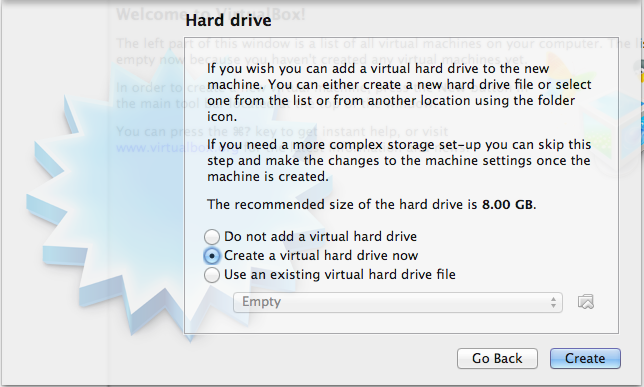
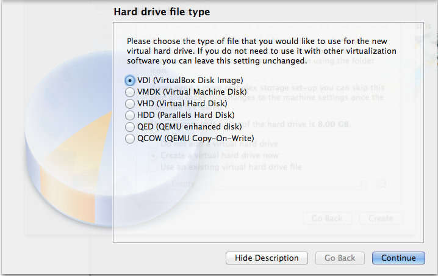
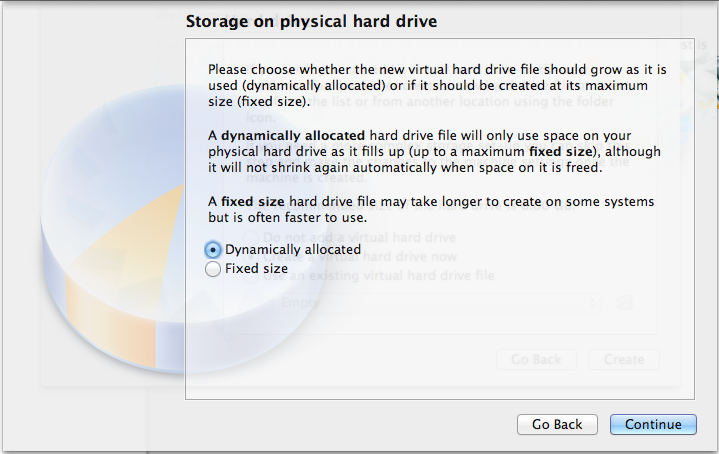
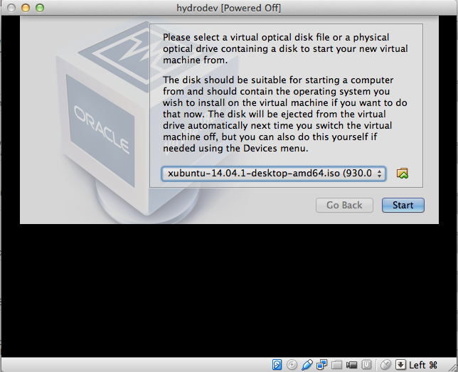
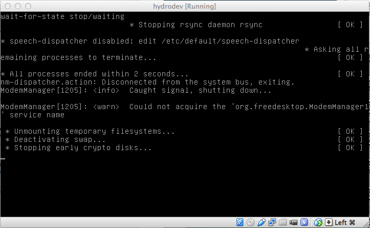
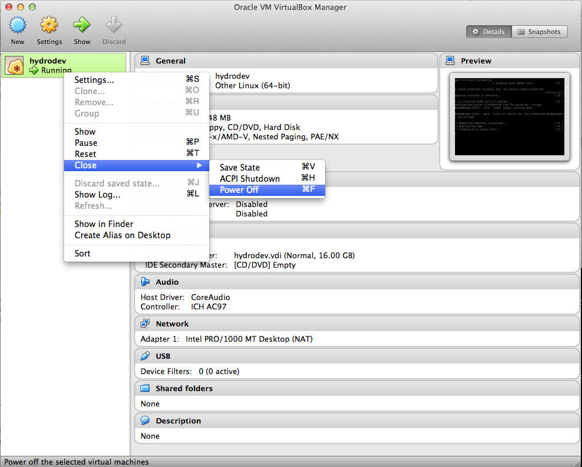
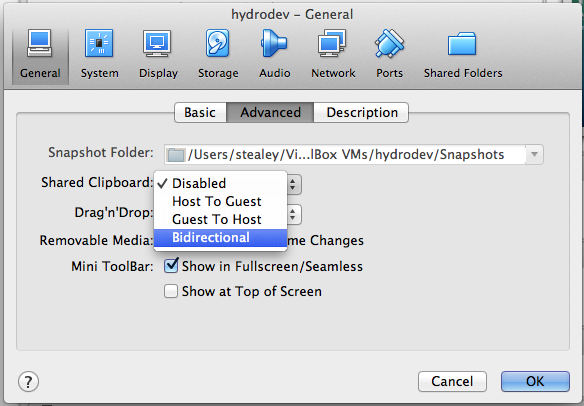
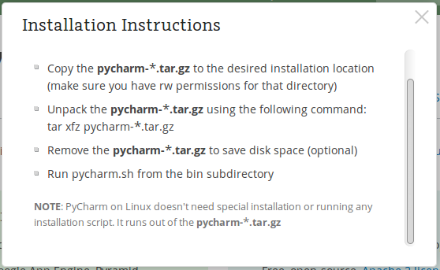

# Building HydroShare Development Environment

## Purpose of this document

---

This document has been created to provide the recipe for creating a HydroShare development environment from scratch as it evolves based on developer feedback.

## Pre-built image

As this "recipe" gets iterated upon and updated, a pre-built image will also be available for users to download directly if they prefer.

### Current hydrodev image
* Date released: **10-06-2014**
* Image size: **2.4 GB**
* Link to image: **[Download](http://distribution.hydroshare.org/public_html/hydrodev_10-06-2014.zip)**

### Installation notes
* Unzip image contents to your **_VirtualBox VMs_** directory
* From VirtualBox UI, choose **_Machine > Add_** and select the newly unzipped image
* From VirtualBox UI, choose **_Start_**
* Windows users may receive a **USB 2** related error. To fix this, from the VirtualBox UI, choose **_Settings > Ports > USB: Uncheck the "Enable USB 2.0 (EHCI) Controller"_**
	* Screenshots of this to be added at a later date


---

## Building HydroShare development environment (hydrodev) from scratch

### Overview

1. VirtualBox
	1. Install
	1. Configuration
1. Xubuntu
	1. Install/Update base OS
	1. Install VirtualBox-Guest-Additions
	1. Package Installation
		- Git
		- Docker
		- Fig (pip Install)
		- PyCharm (Sun Java)
		- kdiff3
		- vim
1. Post-Build Configuration
	1. PyCharm license
	1. Git configuration


<!-- Pandoc compilation notes
to pdf: $ pandoc -V geometry:margin=1in <source>.md -o <output>.pdf
-->

## VirtualBox

Development VM is created using VirtualBox ([Download VirtualBox](https://www.virtualbox.org/wiki/Downloads)).
In this example we are using version 4.3.16


### Name and Operating System

From the VirtualBox UI, select New Machine. A new window will pop-up that should be filled out with the following information.
 
- Name: **hydrodev**
- Type: **Linux**
- Version: **Other Linux (64-bit)**


### Memory Size

Memory allocation set to 2 GB. This is user configurable and can be changed locally via the settings panel to better server the host environment.


### Hard drive

Choose **Create a virtual hard drive now**.



### Hard drive file type

Choose **VDI (VirtualBox Disk Image)**.



### Storage on physical hard drive

Choose **Dynamically allocated**.



### File location and size

Default is 8 GB, we've increased this to **16 GB** in order to accommodate local building of Docker images within the Guest.


### VM Manager

Review the settings that have been made and verify that they are compliant with your Host operating system.


### Install Guest Operating System

Start the hydrodev VM from the VirtualBox Manager UI by pressing the **Start** icon.

When prompted, choose the location where you downloaded the .iso for xubuntu.

For this example we are using Xubuntu 14.04 LTS from [xubuntu.org](http://xubuntu.org).

Can be downloaded using [64-bit torrent file](http://torrent.ubuntu.com/xubuntu/releases/trusty/release/desktop/xubuntu-14.04.1-desktop-amd64.iso.torrent)



### User settings for hydrodev VM

Follow the installation prompts and use the default values until you get to the user settings.

When prompted, enter the user settings as follows:

- Your name: **hydrodev**
- Your computers name: **hydrodev-VirtualBox**
- Pick a username: **hydro**
- Choose a password: **hydro**
- Confirm your password: **hydro**
- Log in automatically: **Choose this radio-button**

Then press **Continue**


### Success

If all goes well you should be boot into the new VM. The screen resolution will be small until VirtualBox Guest Additions are installed which is covered in the next section.


### Trouble Shooting

If the process takes several minutes and leaves you in a terminal, then it's possible that the Guest CD is still linked to your install .iso.



If this is the case, you can manually power off the VM from the VirtualBox Manager and check to make sure that the Guest CD is labeled as **Empty**.

Once verified that the Guest CD is empty, click the **Start** icon from the VirtualBox Manager.



---

## Xubuntu

Xubuntu is an elegant and easy-to-use operating system. Xubuntu comes with Xfce, which is a stable, light and configurable desktop environment.

Xubuntu is perfect for those who want the most out of their desktops, laptops and netbooks with a modern look and enough features for efficient, daily usage. It works well on older hardware too.

### Building base image for hydroshare development

Use Xubuntu 14.04 LTS from [xubuntu.org](http://xubuntu.org).

Can be downloaded using [64-bit torrent file](http://torrent.ubuntu.com/xubuntu/releases/trusty/release/desktop/xubuntu-14.04.1-desktop-amd64.iso.torrent)

Machine Name: `hydrodev`

User / Pass: `hydro` / `hydro`

When logged in you should be `hydro@hydrodev-VirtualBox`

### VirtualBox Guest Additions

Prior to moving forward with the software updates it is best to install the VirtualBox Guest Additions to the Guest OS. Once installed, you will have more resolution options as well as copy/paste functionality.

```
# install virtualbox guest additions
$ sudo apt-get install -y virtualbox-guest-dkms
```

Reboot VM in order for the updated screen resolution options from virtualbox guest additions to take effect.

Enable Bidirectional Shared Clipboard by selecting Settings from the VirtualBox Manager, then choose the General tab.

- Shared Clipboard: **Bidirectional**



### Base software install / updates

Update / install virtualbox guest additions, pip, git and others (versions shown for informational purposes)

```
# update and upgrade existing software
$ sudo apt-get update
$ sudo apt-get upgrade

# install git
$ sudo apt-get install git
$ git --version
git version 1.9.1

# install python-pip
$ sudo apt-get install python-pip
$ pip --version
pip 1.5.4 from /usr/lib/python2.7/dist-packages (python 2.7)
$ python --version
Python 2.7.6

# install kdiff3 (mergetool for use by git)
$ cd /tmp/
$ wget http://sourceforge.net/projects/kdiff3/files/kdiff3/0.9.98/kdiff3-0.9.98.tar.gz
$ tar -xzf kdiff3-0.9.98.tar.gz
$ sudo apt-get install libqt4-dev
$ cd kdiff3-0.9.98/src-QT4
$ qmake kdiff3.pro
$ make
$ sudo make install

# install vim-gtk (vim editor)
$ sudo apt-get install vim-gtk
```

## Install Docker

Docker is an open platform for developers and sysadmins to build, ship, and run distributed applications. Consisting of Docker Engine, a portable, lightweight runtime and packaging tool, and Docker Hub, a cloud service for sharing applications and automating workflows, Docker enables apps to be quickly assembled from components and eliminates the friction between development, QA, and production environments. As a result, IT can ship faster and run the same app, unchanged, on laptops, data center VMs, and any cloud.

To install the latest Ubuntu package (may not be the latest Docker release):

```
$ sudo apt-get update
$ sudo apt-get install docker.io
$ sudo ln -sf /usr/bin/docker.io /usr/local/bin/docker
$ sudo sed -i '$acomplete -F _docker docker' /etc/bash_completion.d/docker.io
$ docker --version
Docker version 1.0.1, build 990021a
```

Set Docker permissions to allow `hydro` to call without using `sudo`

**Note**: need to log out and back in for the changes to take effect

```
$ sudo groupadd docker
# If group already exists the ouput will be
groupadd: group 'docker' already exists
$ sudo gpasswd -a ${USER} docker
Adding user hydro to group docker
$ sudo service docker restart
docker: unrecognized service
$ sudo service docker.io restart
docker.io stop/waiting
docker.io start/running, process <PID>
```

## Install Fig

Fast, isolated development environments using Docker. Fig is available as a Python package.

```
$ sudo pip install -U fig
$ fig --version
fig 0.5.2
```

## Install PyCharm

PyCharm is a Python IDE, having some interesting functions like: code completion, error highlighting, customizable UI and key-bindings for VIM, VCS integrations or automated code refactorings and good navigation capabilities. The latest version available is PyCharm 3.4, which has been recently released, coming with a bunch of improvements and fixes.

PyCharm requires Oracle Java. If you don’t have it on your system, do this to [install Java 8](http://linuxg.net/how-to-install-the-oracle-java-8-java-7-or-java-6-on-ubuntu-14-0413-1012-1012-04-linux-mint-161413-and-elementary-os-0-2-luna/):

Install Java

```
$ sudo apt-get purge openjdk*
$ sudo add-apt-repository ppa:webupd8team/java
$ sudo apt-get update
$ sudo apt-get install oracle-java8-installer
$ java -version
java version "1.8.0_20"
Java(TM) SE Runtime Environment (build 1.8.0_20-b26)
Java HotSpot(TM) 64-Bit Server VM (build 25.20-b23, mixed mode)
```

### Preferred - PyCharm Professional Edition

Install Pycharm (Professional Edition)

Download the professional installer from [http://www.jetbrains.com/pycharm/download/](http://www.jetbrains.com/pycharm/download/)

The download will likely be placed in the `/home/hydro/Downloads` directory.

Next perform the following

```
$ mv /home/hydro/Downloads/pycharm-professional-3.4.1.tar.gz ~/
$ tar -xzf pycharm-professional-3.4.1.tar.gz
$ rm pycharm-professional-3.4.1.tar.gz
$ cd pycharm-3.4.1/bin/
$ ./pycharm.sh
```



At this point a window will pop-up asking for your PyCharm license information. This is the license key that was sent to you in a private email by the project PI, or other person in charge of distributing the license.

If you do not have a valid license, you can use the information below to install the community edition of PyCharm.


### Optional - PyCharm Community Edition

Install PyCharm (Community Edition)

```
$ wget -q -O - http://archive.getdeb.net/getdeb-archive.key | \
sudo apt-key add -
$ sudo sh -c 'echo "deb http://archive.getdeb.net/ubuntu trusty-getdeb apps" \
>> /etc/apt/sources.list.d/getdeb.list'
$ sudo apt-get update
$ sudo apt-get install pycharm
```
To Remove PyCharm (Community Edition)

```
$ sudo apt-get remove pycharm
```


## Distribute hydrodev VM

### Clear the Bash history

Clear bash history before saving the hydrodev VM for distribution to others.
The final command run from the VM prior to shutting down should be.

```
$ cat /dev/null > ~/.bash_history && history -c && exit
```

### Zip and distribute

This example was built on OS X, and as such the `zip` command requires some arguments to be passed in order to be usable on other platforms such as Windows.

```
$ tar -zcvf hydrodev.tar.gz <path_to_VirtualBox_VM_folder>
```

Windows

using 7Zip

Right Click > 7-Zip > Add to archive...


## Post Deployment Setup

### Git information

Add your Git information to the VM

```
*** Please tell me who you are.

Run

  git config --global user.email "you@example.com"
  git config --global user.name "Your Name"

to set your account's default identity.
Omit --global to set the identity only in this repository.
```

Once input, verify your information with `git config --list`