# HydroShare Development Environment - PyCharm

This document is part of the [Hydroshare Developers' Guide](https://github.com/hydroshare/hydroshare/wiki/Hydroshare-Developers'-Guide)

## Setup PyCharm

### Running PyCharm for the first time

By default PyCharm Professional is installed on the hydrodev VM.

You should enter your license key for PyCharm by doing the following.

```
$ cd ~/pycharm-3.4.1/bin/
$ ./pycharm.sh 
```

Terminal output should look something like this

```
hydro@hydrodev-VirtualBox:~$ cd ~/pycharm-3.4.1/bin/
hydro@hydrodev-VirtualBox:~/pycharm-3.4.1/bin$ ./pycharm.sh 
	Java HotSpot(TM) 64-Bit Server VM warning: ignoring option MaxPermSize=350m; support was removed in 8.0
	Oct 31, 2014 3:49:36 PM java.util.prefs.FileSystemPreferences$1 run
INFO: Created user preferences directory.
	Oct 31, 2014 3:49:36 PM java.util.prefs.FileSystemPreferences$6 run
WARNING: Prefs file removed in background /home/hydro/.java/.userPrefs/prefs.xml
```

You will likely not have any settings to import the first time you run PyCharm, so choose the second option and click **OK**.

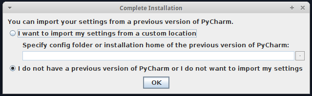

Next you will be prompted to input your license key information into the dialogue screen. This information was given to you by the project PI, or Lead Investigator of the project.


Accept the terms of the license agreement.

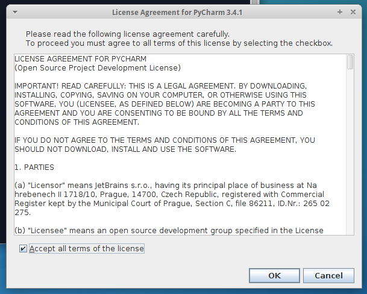

PyCharm initial configuration

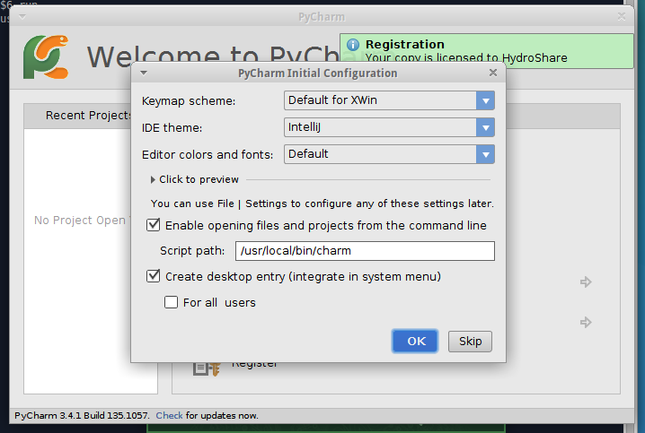

PyCharm requires superuser credentials in order to install system level files

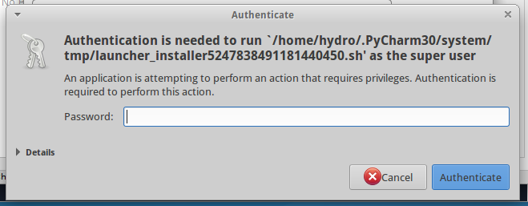

At this point you should have a registered version of PyCharm

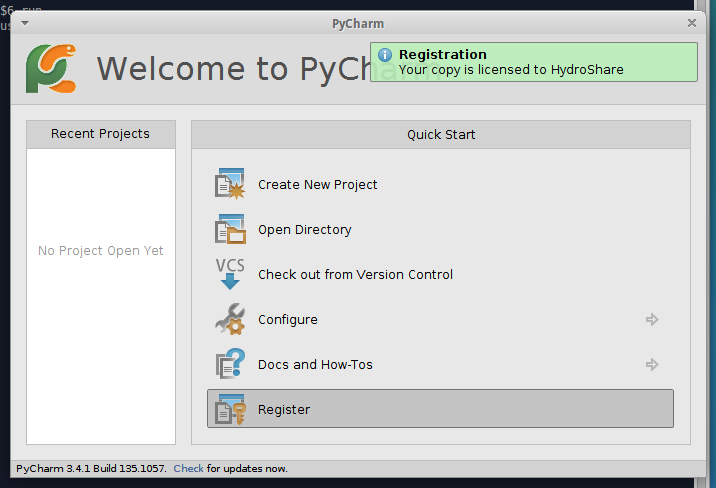


### Configure Source Control

In the File menu, click `Open directory` and select the hydroshare repository you just cloned in the section **HydroShare Development Environment - [Running Code](https://github.com/hydroshare/hydroshare/wiki/hydroshare_development_environment_runningcode)**.


In the example the repository directory is called `hydroshare`, but for you it is just where-ever you cloned the hydroshare repository at.

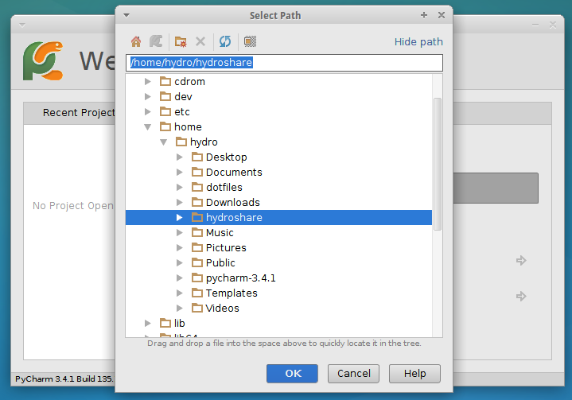

### Configure Git project roots

At this point, PyCharm knows where your code is, but it doesn't know about GitHub.  To correct that, you will want to register your Git roots with PyCharm.

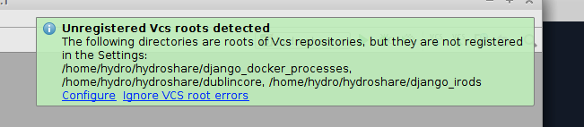

Open the "Settings" menu (`File > Settings`).  It may be called "Preferences" on a Mac OS.  If the screen that comes up doesn't look like the image below when you open it, click the "Version Control" item from the menu on the left hand side.

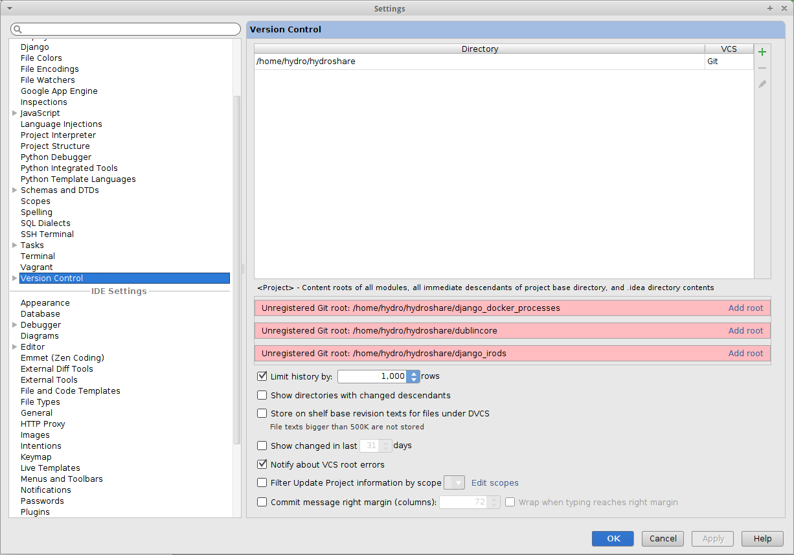

Now you will want to click "add root" on all the red boxes. Once complete the version control portion of settings should look as it does below.


### Configure Code Deployment

This section helps you configure PyCharm so that the code you develop in the IDE gets deployed to the container running on your virtual machine when you want to test it.  All the steps in this subsection (steps **a** through **e**) require that you are in the "Settings" (or "Preferences" on some systems) dialog. 

#### (a.) Open the Settings dialog. Pick the item _Project > Deployment > Options_, and follow the instructions below:

* Check “Create empty directories”
* Check “Delete target items when source ones do not exist”
* Switch “Upload changed files automatically to the default server” to “Always”
    * **NOTE** If you plan on setting up [PyCharm Remote Debugging](https://github.com/hydroshare/hydroshare/wiki/hydroshare_development_environment_pycharm_remote_debugging.md) then you may want set this to "Never", and control the uploads manually  
* Click "Apply"


#### (b.) Add a server for Deployment:

* Pick the item _Project > Deployment_.
* Click the `+` sign to add a new Deployment target.
* Give it a name. 
* Pick the SFTP protocol if it is not already picked.
* Click "OK". 


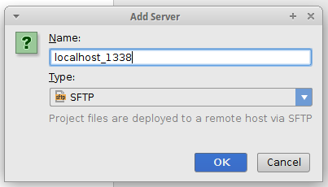

#### (c.) Edit the connection settings:
 
* Click the `Connection` tab in the dialog.
* Your settings should look like this:
    * **SFTP Host**: `localhost`
    * **Port**: `1338`
    * **Root Path**: `/`
    * **Username**: `docker`
    * **Auth type**: `password`
    * **Password**: `docker`
    * **Web server root url**: `http://localhost:8000`
* Click "Test SFTP Connection" to make sure that settings work.  If they do not, send a support request to hydroshare-dev
* Click "Apply"


If this is the first time connecting to localhost you will likely see this  prompt.


Upon completion you should see a successful conneciton message.


#### (d.) Setup the deployment mapping:

* Pick the item _Project > Deployment_.
* Click the `Mappings` tab in the dialog.
* Set the local path to the path were you cloned the hydroshare repository
* Set the deployment path on the server to `/home/docker/hydroshare`
* Set the web path on the server to `/`
* Click "Apply"

The results should look like this:


#### (e.) Enable Django support. 

* Pick the item _Django Support_
* Enable Django support by checking on the box.

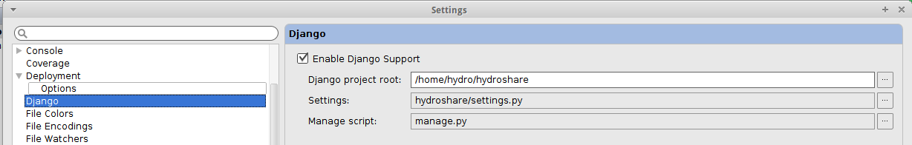

### Configure remote interpreter

This section helps you configure PyCharm so that you can run and test code in an interpreter and so that PyCharm can syntax check and perform autocompletion using the code and libraries in the container.  All the steps in this subsection require that you are in the Settings (or Preferences on some systems) dialog. 

* Pick the item _Project Interpreter_
* Click the **Gear** icon and choose "Add Remote" to add a new remote interpreter
* Click the "Deployment Configuration" radio button
* Click "OK"
* Click the name of the deployment server you setup (Remote Python 2.7.6 ... )
* Click "OK" at the bottom of the window

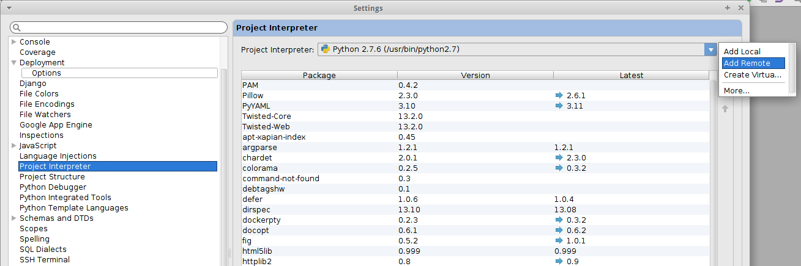


