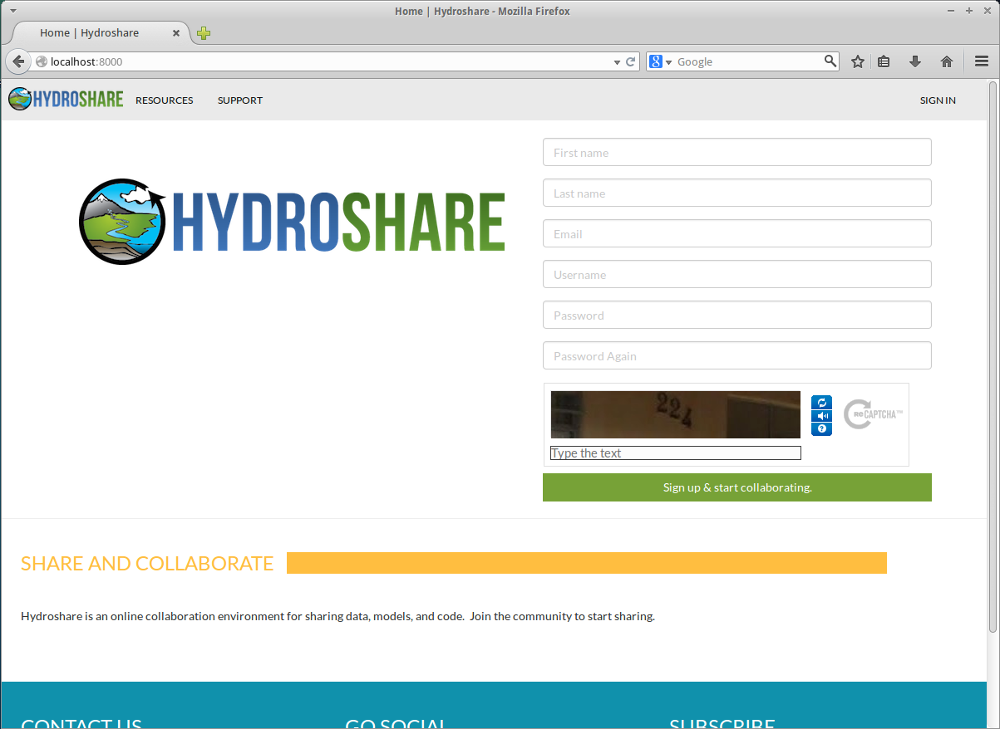
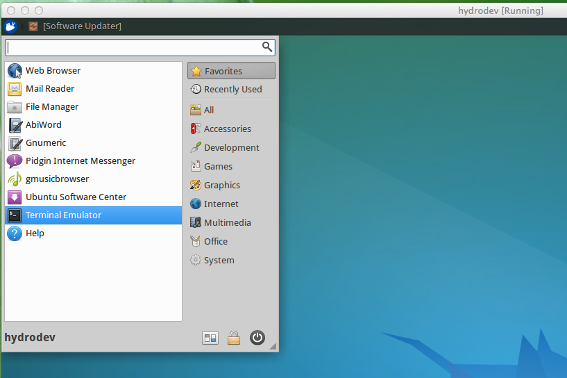
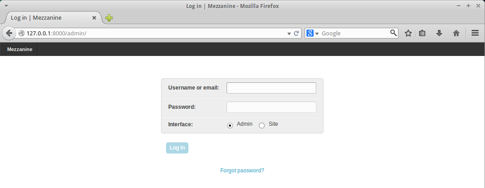
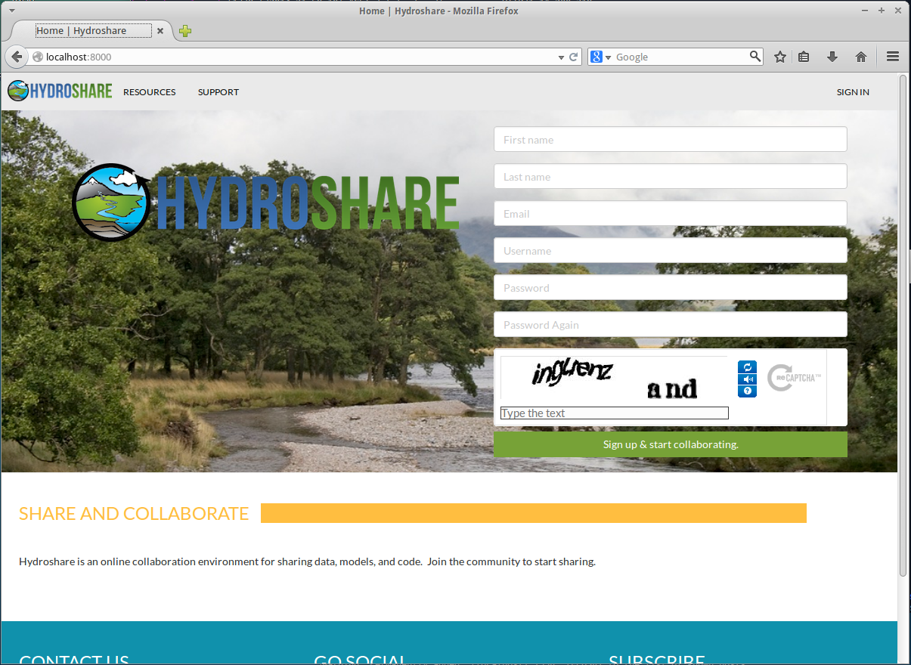
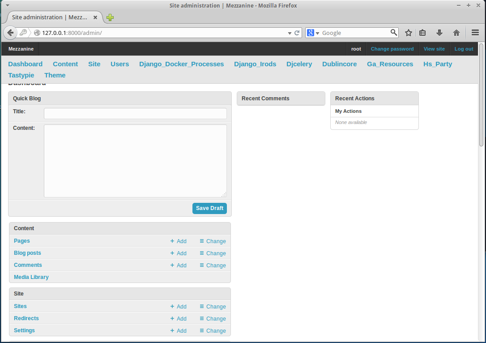

# HydroShare Development Environment - Running Code

This document is part of the [Hydroshare Developers' Guide](https://github.com/hydroshare/hydroshare/wiki/Hydroshare-Developers'-Guide)

## Quick Start

Open a terminal on **hydrodev**

If you haven't done so already, clone the hydroshare git repository into `/home/hydro`

```
$ cd /home/hydro
$ git clone https://github.com/hydroshare/hydroshare.git
```

In git, switch to the branch of code that you want to work from:
```
$ cd /home/hydro/hydroshare/
$ git checkout develop && git pull
$ git branch <issue_no.>-<branch_desc>
$ git checkout <issue_no.>-<branch_desc>
```
Then cd to the checked out **hydroshare** repository, and 

```
$ git submodule init
$ git submodule update
$ cd hs_docker_base/
$ docker build -t hs_base .
$ cd ../
$ ./deploy-hs
$ docker-compose up -d
```
Stop the docker components and migrate to synchronize the database with the latest code

```
$ docker-compose stop
$ docker-compose run --rm hydroshare /bin/bash
```
At this point you are running inside a docker container as indicated by the # prompt. Now: 

```
# dropdb -U postgres -h postgis postgres
# createdb -U postgres -h postgis postgres
# psql -U postgres -h postgis -f pg.development.sql
# python manage.py migrate
```
If you want an admin password, then: 
```
python manage.py createsuperuser 
```
Return to the main machine:
```
# exit
```
Now at the main machine
```
$ docker-compose up -d
```
Note that at the last line an alternative is just:
```
$ docker-compose up
```
This will leave a terminal running in which you can see output from the programs.  This is sometimes helpful for debugging.  If you do this, you need to open a separate terminal to continue with the remaining commands.

At this point you should be able to open a browser on hydrodev and see HydroShare running at **http://localhost:8000/**



If the networking is configured for external access (e.g. bridged for a virtual machine) the HydroShare website can also be accessed from a browser elsewhere such as the host.  Obtain the guest ip address
```
ifconfig
```
Note the eth0 address


Use following URL to test from the host
http://192.168.1.109:8000 

---

## Detailed Information

After installing Hydroshare development environment [hydrodev](build_hydroshare_dev_environment), you can quickly verify that it is working as expected using the following.

Open Terminal Emulator in the hydrodev xubuntu VM. You should see a new window with the terminal prompt: `hydro@hydrodev-VirtualBox:~$`. 



From here forward, this prompt will be referred to using the `$` symbol, and should be the place where you enter the command line calls.


1. Navigate to the `hydro` user's home directory
	
	```
	$ cd /home/hydro/
	```
1. Clone the hydroshare repository from Github

	```
	$ git clone https://github.com/hydroshare/hydroshare.git
	```
1. Navigate into the new `hydroshare` directory, and initialize and update the 3rd party submodules (_django_docker_processes_, _django_irods_ and _dublincore_)

	```
	$ cd hydroshare/
	$ git submodule init
		Submodule 'django_docker_processes' (https://github.com/hydroshare/django_docker_processes.git) registered for path 'django_docker_processes'
		Submodule 'django_irods' (https://github.com/hydroshare/django_irods) registered for path 'django_irods'
		Submodule 'dublincore' (https://github.com/hydroshare/django-dublincore.git) registered for path 'dublincore'

	$ git submodule update
		Cloning into 'django_docker_processes'...
		remote: Counting objects: 165, done.
		remote: Compressing objects: 100% (68/68), done.
		remote: Total 165 (delta 94), reused 165 (delta 94)
		Receiving objects: 100% (165/165), 738.23 KiB | 29.00 KiB/s, done.
		Resolving deltas: 100% (94/94), done.
		Checking connectivity... done.
		Submodule path 'django_docker_processes': checked out '96b9052d061a6acbe77b15e5f5adcbd1c7ab11b3'
		Cloning into 'django_irods'...
		remote: Counting objects: 104, done.
		remote: Compressing objects: 100% (54/54), done.
		remote: Total 104 (delta 46), reused 104 (delta 46)
		Receiving objects: 100% (104/104), 64.12 KiB | 0 bytes/s, done.
		Resolving deltas: 100% (46/46), done.
		Checking connectivity... done.
		Submodule path 'django_irods': checked out 'a45cf459335870a5079d941658394a6718f332d0'
		Cloning into 'dublincore'...
		remote: Counting objects: 178, done.
		remote: Total 178 (delta 0), reused 0 (delta 0)
		Receiving objects: 100% (178/178), 62.73 KiB | 0 bytes/s, done.
		Resolving deltas: 100% (87/87), done.
		Checking connectivity... done.
		Submodule path 'dublincore': checked out '6baebe65bf6bad1adc5022c83ce4c0c790e6ae92'

	```
1. Change directories to be in the `hs_docker_base` directory and build the base hydroshare container which we will tag as `hs_base`. The `docker build` command will take some time to run, and can vary depending on download speed as it retrieves code from the internet, and on resource allocation given to the VM from the VirtualBox UI settings.

	```
	$ cd hs_docker_base/
	$ docker build -t hs_base . 
		...
		...
	Step 17 : RUN echo docker:docker | chpasswd
 		---> Running in 47734bbf6e52
 		---> 42a53cebd3c3
	Removing intermediate container 47734bbf6e52
	Successfully built 42a53cebd3c3

		
	```
1. Verify the creation and tagging of `hs_base`. There will be many images listed and hs_base should be tagged as the latest one.

	```
	$ docker images
		REPOSITORY          TAG                 IMAGE ID            CREATED             		VIRTUAL SIZE
		hs_base             latest              42a53cebd3c3        6 minutes ago       1.189 GB
		ubuntu              utopic              2db9ad9043ca        5 days ago          307.8 MB
		ubuntu              14.10               2db9ad9043ca        5 days ago          307.8 MB
		...
	```
1. Change back into the main hydroshare directory (one level up)

	```
	$ cd ../
	```
1. Use `fig` to build and launch the docker containers for running the hydrodshare web site. The `fig up` command may take some time to run, but when it completes you will see the containers information output in the terminal window relative to the action being performed.

	```
	$ fig build
	postgis uses an image, skipping
	redis uses an image, skipping
	rabbitmq uses an image, skipping
	Building hydroshare...
	 ---> 42a53cebd3c3  
	Step 1 : ADD . /home/docker/hydroshare
		...
	Step 23 : CMD /bin/bash
	 ---> Using cache
	 ---> e1566835016b
	Successfully built e1566835016b
	
	$ fig up
	Creating hydroshare_postgis_1...
	Pulling image jamesbrink/postgresql...
	3908b40ff754: Pulling dependent layers
		...
	hydroshare_1    | 
	hydroshare_1    | /usr/local/lib/python2.7/dist-packages/mezzanine/utils/conf.py:59: UserWarning: TIME_ZONE setting is not set, using closest match: None
	hydroshare_1    |   warn("TIME_ZONE setting is not set, using closest match: %s" % tz)
	hydroshare_1    | /home/docker/hydroshare/hs_core/models.py:25: DeprecationWarning: django.utils.simplejson is deprecated; use json instead.
	hydroshare_1    |   from django.utils import simplejson as json

	```
	
	
	
	After the containers all launch and are running, you can open a new terminal emumlator window and verify their status using the `fig ps` command
	
	```
	$ fig ps
	           Name                         Command               State              Ports             
		--------------------------------------------------------------------------------------------------
		hydroshare_postgis_1         /var/lib/postgresql/postgr ...   Up      5432/tcp                     
		hydroshare_redis_1           redis-server /etc/redis/re ...   Up      6379/tcp                     
		hydroshare_rabbitmq_1        rabbitmq-start                   Up      15672/tcp, 5672/tcp          
		hydroshare_hydroshare_1      /bin/bash init                   Up      8000->8000/tcp, 1338->22/tcp 
		hydroshare_defaultworker_1   celery worker -A hydroshar ...   Up                                   
		hydroshare_dockerworker_1    celery worker -A hydroshar ...   Up     
	```
	
1. Open a browser **inside of the VM**, and check the following URLs.
	- **Main Page:** localhost:8000/
	
	
	
	- **Admin Page:** localhost:8000/admin/
	
	You should be presented with the login interface for Admin
	
	
	A default administative account is available in the development code
	
	- Username: **admin**
	- Password: **default**
	
	

1. Adding the background image
	- The background image can be added to the running container by using the **restore-media-linux** script. When prompted for the `root@localhost` password, it will be **docker**.
	
	```
	$ ./restore-media-linux hydroshare-development-media.tar.gz 
		The authenticity of host '[localhost]:1338 ([127.0.0.1]:1338)' can't be established.
		ECDSA key fingerprint is 95:57:68:30:c9:32:87:a8:aa:d1:1f:f2:32:6a:13:9d.
		Are you sure you want to continue connecting (yes/no)? yes
		Warning: Permanently added '[localhost]:1338' (ECDSA) to the list of known hosts.
		root@localhost's password: 
		3913787974_7c36d03071_o.jpg                                                                                                   		100% 2298KB   2.2MB/s   00:01    
		3913787974_7c36d03071_o-1000x500.jpg                                                                                          		100%  238KB 237.5KB/s   00:00    
		3913787974_7c36d03071_o-60x60.jpg                                                                                             		100% 9814     9.6KB/s   00:00    
		~/hydroshare
	```
	Now refresh the browser window on the **Main Page:** localhost:8000/
	
	


### Other items

1. Restore database contents

	```
	To be completed
	```
1. Restore media files

	```
	To be completed
	```
1. Create a superuser - From the `hydroshare` directory you can issue the `createsuperuser` command in order to create a new superuser on your local hydroshare site.

	```
	$ cd /home/hydro/hydroshare/
	$ fig run --rm hydroshare python manage.py createsuperuser
	/usr/local/lib/python2.7/dist-packages/mezzanine/utils/conf.py:59: UserWarning: TIME_ZONE setting is not set, using closest match: None
  		warn("TIME_ZONE setting is not set, using closest match: %s" % tz)
	/home/docker/hydroshare/hs_core/models.py:25: DeprecationWarning: django.utils.simplejson is deprecated; use json instead.
  		from django.utils import simplejson as json

	Username (leave blank to use 'root'): 
	Email address: root@example.com	
	Password: 
	Password (again): 
	Superuser created successfully.
	Removing hydroshare_hydroshare_run_2...
	```
	
	The new superuser can now be used to access both the main site and the admin page on your local installation.
	
	
	
	

## Fig vs. docker-compose

The above instructions are written for docker-compose. Installation is also possible via the workalike 'fig'. Caution: if you install both of these on your host OS for docker, fig will be used for **deploy-hs**. 