# HydroShare Development Environment - VirtualBox

This document is part of the [Hydroshare Developers' Guide](https://github.com/hydroshare/hydroshare/wiki/Hydroshare-Developers'-Guide)

## Preface

The HydroShare development environment is known as **hydrodev**. Hydrodev is a Linux based environment distributed as a **VirtualBox** image for users to download and install on their local machines. VirtualBox is a powerful x86 and AMD64/Intel64 virtualization product for enterprise as well as home use. VirtualBox is freely available as Open Source Software under the terms of the GNU General Public License (GPL) version 2. See "About VirtualBox" for an introduction. Presently, VirtualBox runs on Windows, Linux, Macintosh, and Solaris hosts

We've chosen to use Linux, in particular **Xubuntu**, as the development environment. Xubuntu comes with Xfce, which is a stable, light and configurable desktop environment. Xubuntu contains enough features for efficient, daily usage and it works well on older hardware too. In order to best satisfy the consistency needs of the codebase we also make use of Linux Containers via **docker**.

Docker is an open platform for developers and sysadmins to build, ship, and run distributed applications. Consisting of Docker Engine, a portable, lightweight runtime and packaging tool, and Docker Hub, a cloud service for sharing applications and automating workflows, Docker enables apps to be quickly assembled from components and eliminates the friction between development, QA, and production environments.

---

## VirtualBox

VirtualBox is used to host the hydrodev development environment. ([Download VirtualBox](https://www.virtualbox.org/wiki/Downloads)).

The example shown below uses VirtualBox version 4.3.18 as it would be seen on the Windows (8.1 Enterprise) platform.

Upgrading from a previous installation of VirtualBox may require an update to the extension pack to be compliant with the version of VirtualBox now running. The example shown here makes use of version 4.3.18 with the associated [Extension Pack](http://dlc.sun.com.edgesuite.net/virtualbox/4.3.18/Oracle_VM_VirtualBox_Extension_Pack-4.3.18.vbox-extpack).

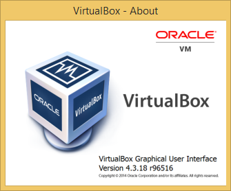


## hydrodev image

The attributes of the hydrodev VM will be the same whether you download the pre-built image, or build it from scratch.

- Computer Name: **hydrodev-VirtualBox**
- Username: **hydro**
- Password: **hydro**

The pre-built **hydrodev** VM is also set to Log in automatically on boot.

---

### Install from pre-built image

Images are updated periodically and created in the format: **_hydrodev_dd_mm_yyyy.tar.gz_**. You should download the most recent image in the **Download Directory** as indicated below.

### Current hydrodev image
* Date released: **01-27-2015**
* Image size: **2.9 GB**
* Link to image: **[Download Directory](http://distribution.hydroshare.org/public_html/)**

### Installation notes
- Extract the image contents to your **_VirtualBox VMs_** directory
	- On Windows: 
		- Using [7-Zip](http://www.7-zip.org)
		- Once installed, 7-Zip is available as a _Right Click_ option
		- This is a two step process, first step will extract the `tar` file from the `tar.gz` file. The second step will unpack all of the hydrodev files from the `tar` file.
		- Extract to: `C:\Users\<username>\VirtualBox VMs\`
	- On OS X: 
		- From terminal, issue `tar -zxvf hydrodev_dd_mm_yyy.tar.gz`
		- Extract to: `/Users/<username>/VirtualBox VMs/`
- From VirtualBox UI, choose **_Machine > Add_** and select the newly unzipped image

- From VirtualBox UI, choose **_Start_**
	- Some Windows users have reported a **USB 2** related error. 

	- To fix this, from the VirtualBox UI, choose **_Settings > Ports > USB: Uncheck the "Enable USB 2.0 (EHCI) Controller"_**
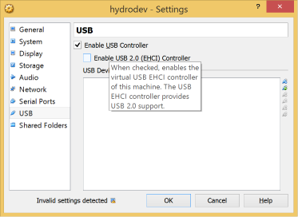
	- Some Windows users have reported a **virtualization** error: _VT-x/AMD-V hardware acceleration is not available on your system. Your 64-bit guest will fail to detect a 64-bit CPU and will not be able to boot._
	- To fix this, enter your **BIOS** and enable **Virtualization Technology**.

### Success!

If all goes well you should be able to boot into the new VM


Feel free to adjust the hydrodev settings from the **Settings** window in the VirtualBox Manager to best fit your needs. Common adjustments are:

- Increase RAM
- Increase CPUs

#### Optional - Use PyCharm Community Edition on Pre-built VM

The machine comes with PyCharm Professional which requires a license. If you'd like to use the free PyCharm Community Edition instead, see installation instructions in the section [Optional - PyCharm Community Edition](#optional---pycharm-community-edition). However, the PyCharm Professional version offers a more complete feature set including debugging features that are not found in the CE. You should really be using it if you plan to do development.

---

### Build from scratch

### Overview

1. VirtualBox
	1. Install
	1. Configuration
1. Xubuntu
	1. Install/Update base OS
	1. Install VirtualBox-Guest-Additions
	1. Package Installation
		- Git
		- Docker
		- Fig (pip Install)
		- PyCharm (Sun Java)
		- kdiff3
		- vim
1. Post-Build Configuration
	1. PyCharm license
	1. Git configuration

## VirtualBox

VirtualBox is used to host the hydrodev development environment. ([Download VirtualBox](https://www.virtualbox.org/wiki/Downloads)).

### Name and Operating System

From the VirtualBox UI, select New Machine. A new window will pop-up that should be filled out with the following information.
 
- Name: **hydrodev**
- Type: **Linux**
- Version: **Other Linux (64-bit)**

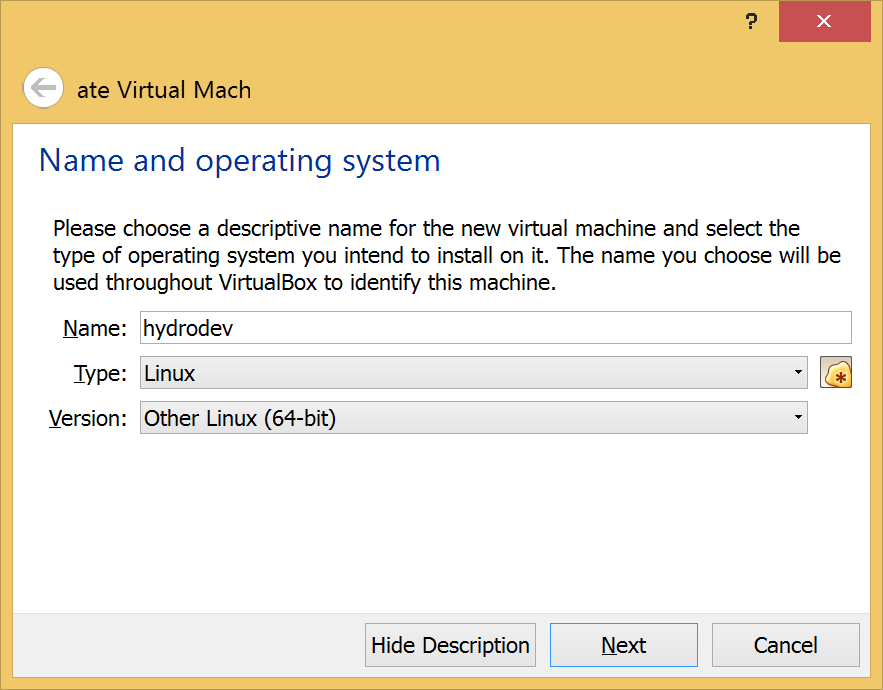

### Memory Size

Memory allocation set to **2048 MB** or 2 GB. This is user configurable and can be changed locally via the settings panel to better server the host environment.


### Hard drive

Choose **Create a virtual hard drive now**.


### Hard drive file type

Choose **VDI (VirtualBox Disk Image)**.


### Storage on physical hard drive

Choose **Dynamically allocated**.


### File location and size

Default is 8 GB, we've increased this to **20.00 GB** in order to accommodate local building of Docker images within the Guest.

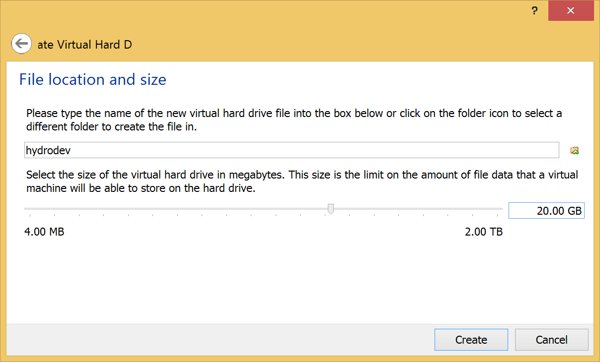

### VM Manager

Review the settings that have been made and verify that they are compliant with your Host operating system.

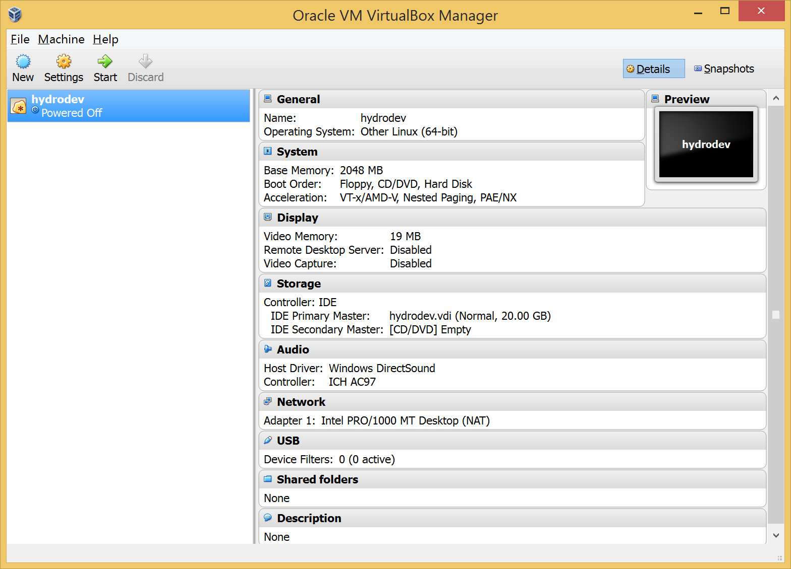

### Install Guest Operating System

Start the hydrodev VM from the VirtualBox Manager UI by pressing the **Start** icon.

When prompted, choose the location where you downloaded the .iso for Xubuntu.

For this example we are using the 64 bit Xubuntu 14.04 LTS from [xubuntu.org](http://xubuntu.org).

Can be downloaded using [64-bit torrent file](http://torrent.ubuntu.com/xubuntu/releases/trusty/release/desktop/xubuntu-14.04.1-desktop-amd64.iso.torrent)


Once the "Start" button is pressed you will be guided through a series of install and configuration questions. For the most part these can all be left at the default setting.

Choose **Install Xubuntu**
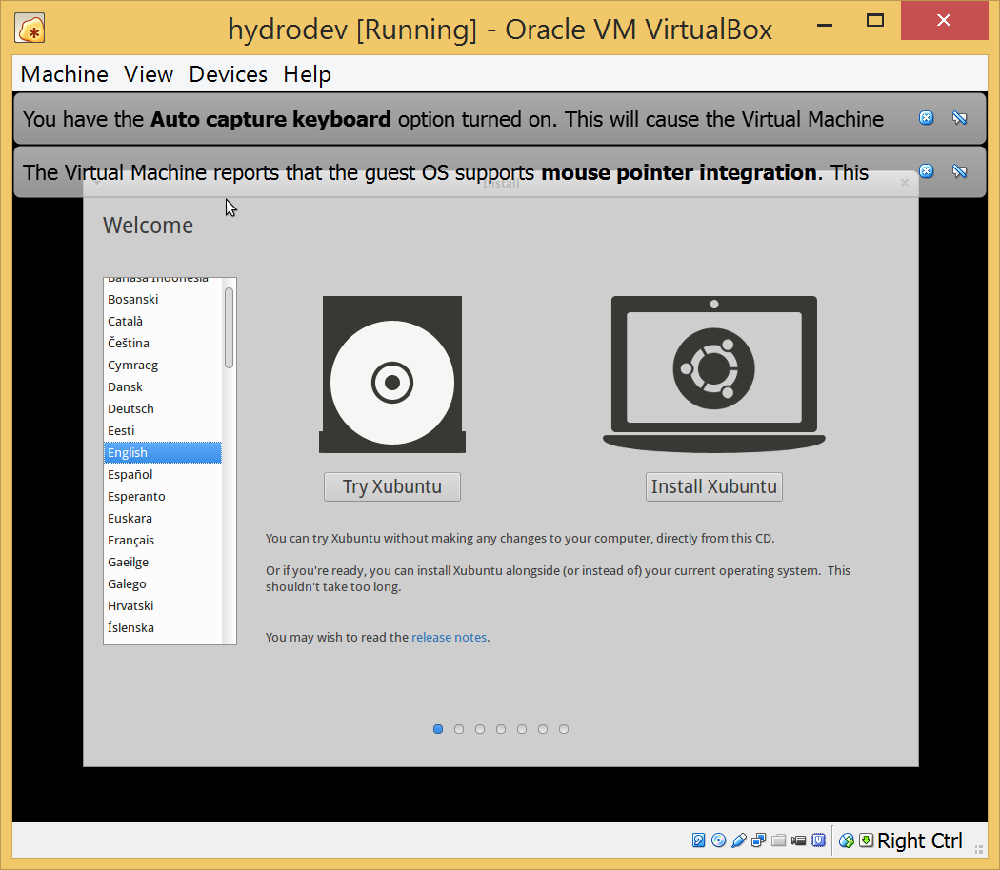

Choose the checkboxes for:

- **Download updates while installing**
- **Install this third-party software**
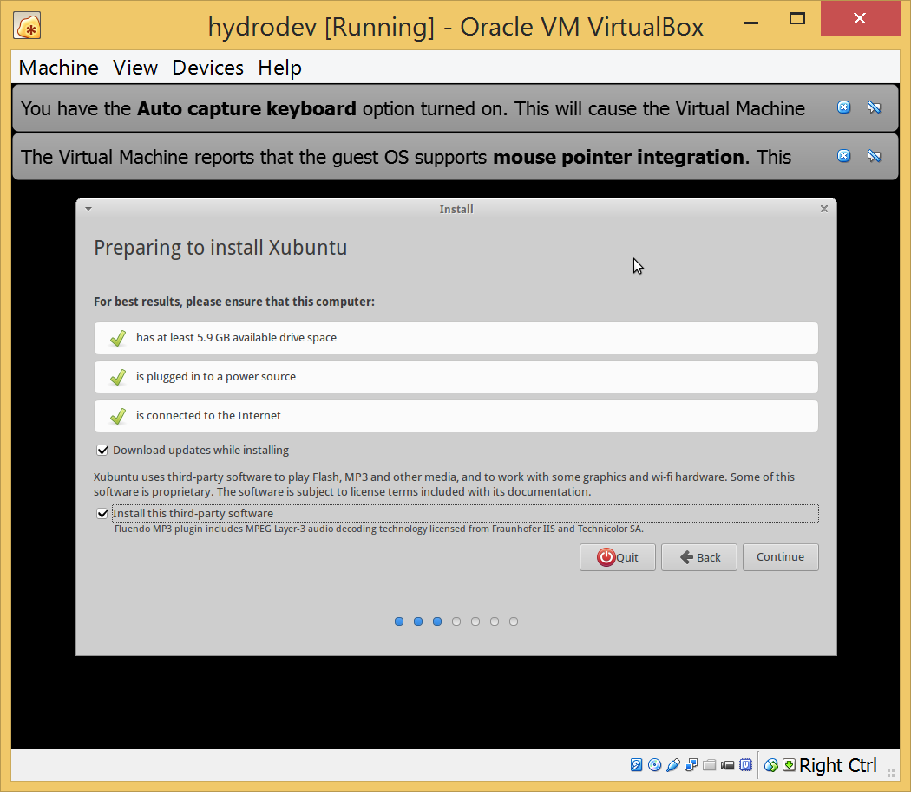

Choose **Erase disk and install Xubuntu**
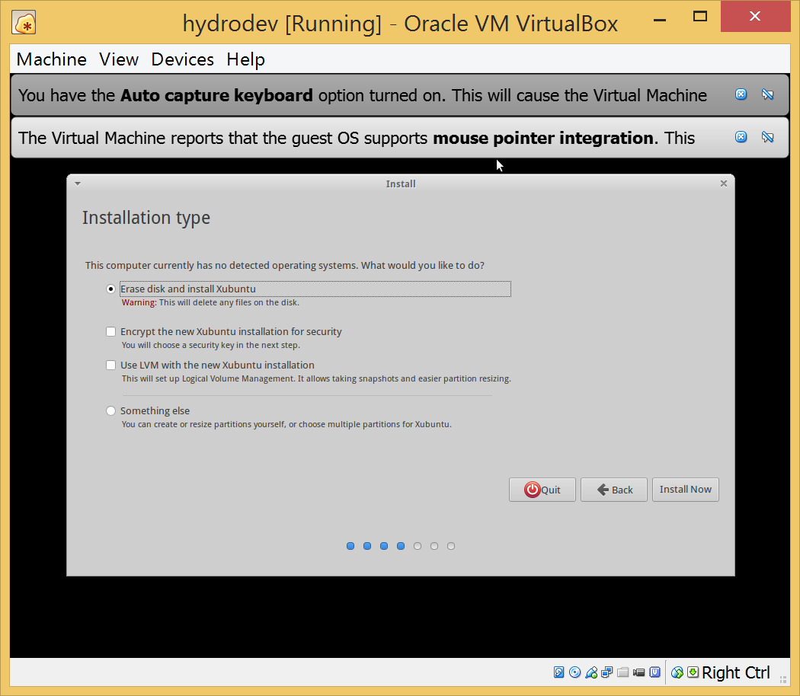

Choose the appropriate timezone


Choose Keyboard layout to be **English (US)**


### User settings for hydrodev VM

Follow the installation prompts and use the default values until you get to the user settings.

Enter the user settings as follows:

- Your name: **hydrodev**
- Your computers name: **hydrodev-VirtualBox**
- Pick a username: **hydro**
- Choose a password: **hydro**
- Confirm your password: **hydro**
- Log in automatically: **Choose this radio-button**

Then press **Continue**

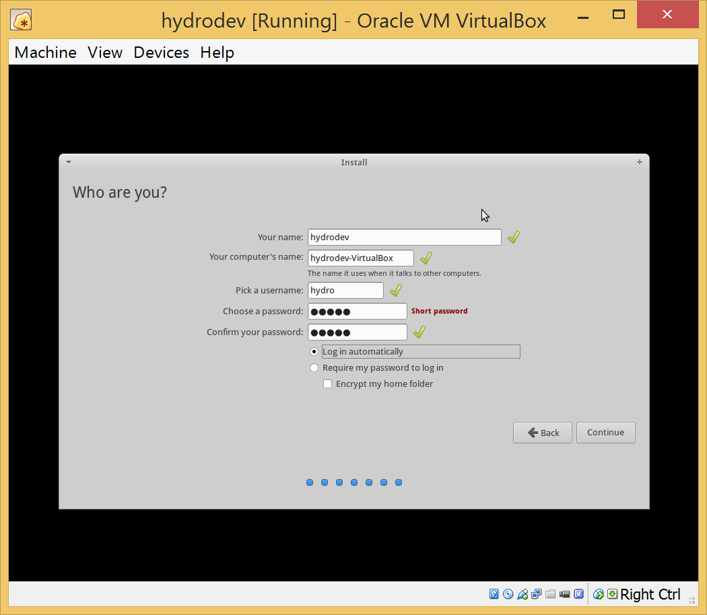

Xubuntu will take several minutes to install, and when it completes will prompt for a reboot.
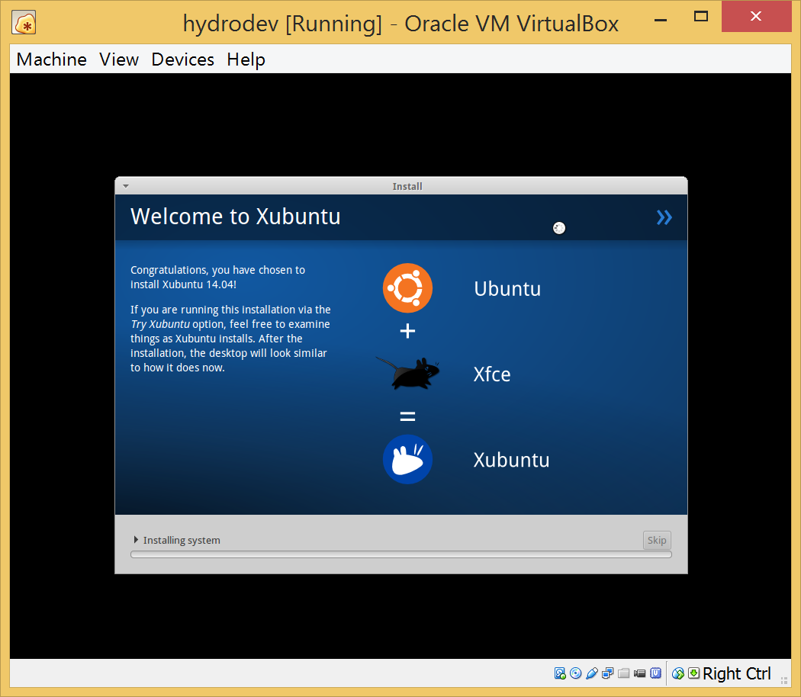

If the reboot process takes several minutes and leaves you in a terminal, then it's possible that the Guest CD is still linked to your install .iso and is hanging.
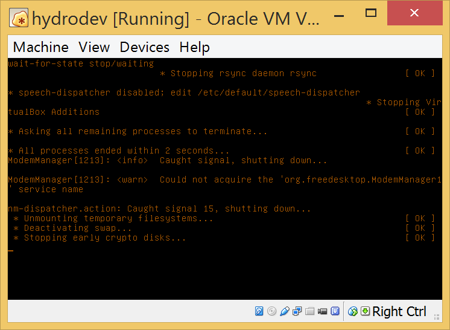

If this is the case, you can manually power off the VM from the VirtualBox Manager and check to make sure that the Guest CD is labeled as **Empty**.
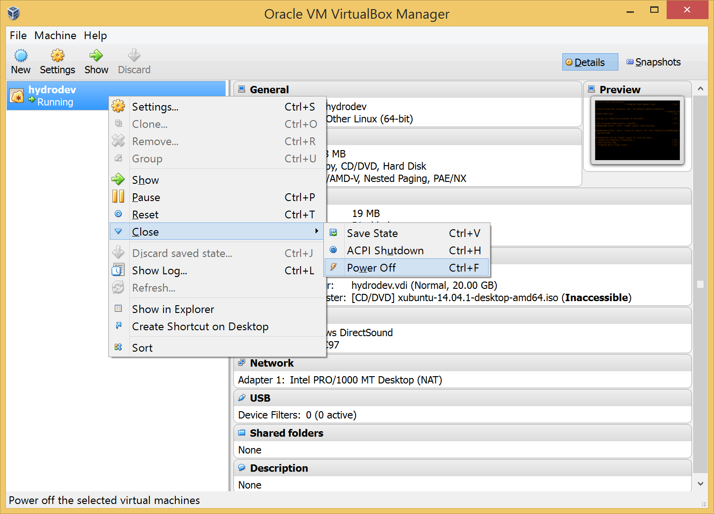

Next change the **Boot Order** from the Settings on the VirtualBox manager, Click "OK", and then click the **Start** icon from the VirtualBox Manager.


### Success!

If all goes well you should be boot into the new VM. The screen resolution will be small until VirtualBox Guest Additions are installed which is covered in the next section.
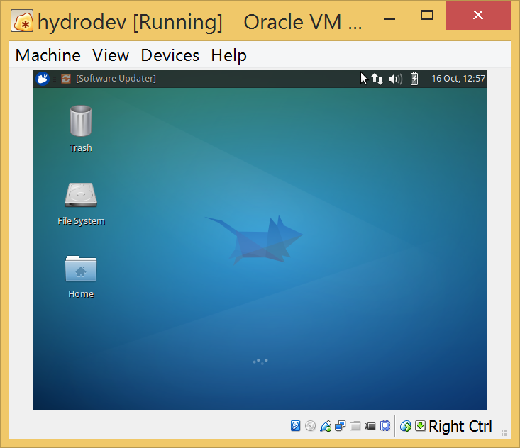

---

## Setting up Xubuntu environment

The HydroShare codebase makes use of some software packages that are not part of the Xubuntu base distribution and we must add those in prior to trying to work with the code.

The attributes of the hydrodev VM will be set as follows:
- Computer Name: **hydrodev-VirtualBox**
- Username: **hydro**
- Password: **hydro**

The **hydro** user has administrative privileges on the machine and can be used to make `sudo` calls from the terminal. When using `sudo` you will be asked for a password which is **hydro**

### VirtualBox Guest Additions

Prior to moving forward with the software updates it is best to install the VirtualBox Guest Additions to the Guest OS. Once installed, you will have more resolution options as well as copy/paste functionality from the Shared Clipboard.

**install virtualbox guest additions**

```
$ sudo apt-get install -y virtualbox-guest-dkms
```

Reboot VM in order for the updated screen resolution options from virtualbox guest additions to take effect.

Enable Bidirectional Shared Clipboard by selecting Settings from the VirtualBox Manager, then choose the General tab.

- Shared Clipboard: **Bidirectional**

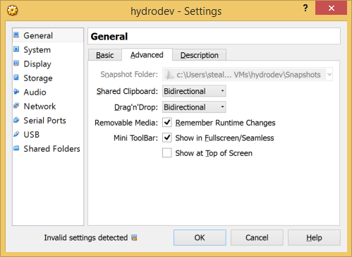

### Base software install / updates

Update / install VirtualBox Guest Additions, pip, git and others (versions shown for informational purposes)

```
# update and upgrade existing software
$ sudo apt-get update
$ sudo apt-get upgrade

# install git
$ sudo apt-get install -y git
$ git --version
git version 1.9.1

# install python-pip
$ sudo apt-get install -y python-pip
$ pip --version
pip 1.5.4 from /usr/lib/python2.7/dist-packages (python 2.7)
$ python --version
Python 2.7.6

# install kdiff3 (mergetool for use by git)
$ cd /tmp/
$ wget http://sourceforge.net/projects/kdiff3/files/kdiff3/0.9.98/kdiff3-0.9.98.tar.gz
$ tar -xzf kdiff3-0.9.98.tar.gz
$ sudo apt-get install libqt4-dev
$ cd kdiff3-0.9.98/src-QT4
$ qmake kdiff3.pro
$ make
$ sudo make install

# install vim-gtk (vim editor)
$ sudo apt-get install -y vim-gtk
```

## Install Docker

Docker is an open platform for developers and sysadmins to build, ship, and run distributed applications. Consisting of Docker Engine, a portable, lightweight runtime and packaging tool, and Docker Hub, a cloud service for sharing applications and automating workflows, Docker enables apps to be quickly assembled from components and eliminates the friction between development, QA, and production environments. As a result, IT can ship faster and run the same app, unchanged, on laptops, data center VMs, and any cloud.

To install the latest Ubuntu package (may not be the latest Docker release):

```
$ sudo apt-get update
$ sudo apt-get install -y docker.io
$ sudo ln -sf /usr/bin/docker.io /usr/local/bin/docker
$ sudo sed -i '$acomplete -F _docker docker' /etc/bash_completion.d/docker.io
$ docker --version
Docker version 1.0.1, build 990021a
```

Set Docker permissions to allow `hydro` to call without using `sudo`

**Note**: need to log out and back in for the changes to take effect

```
$ sudo groupadd docker
# If group already exists the ouput will be
groupadd: group 'docker' already exists
$ sudo gpasswd -a ${USER} docker
Adding user hydro to group docker
$ sudo service docker restart
docker: unrecognized service
$ sudo service docker.io restart
docker.io stop/waiting
docker.io start/running, process <PID>
```

## Install Fig

Fast, isolated development environments using Docker. Fig is available as a Python package.

```
$ sudo pip install -U fig
$ fig --version
fig 0.5.2
```

## Install PyCharm

PyCharm is a Python IDE, having some interesting functions like: code completion, error highlighting, customizable UI and key-bindings for VIM, VCS integrations or automated code refactorings and good navigation capabilities. The latest version available is PyCharm 3.4, which has been recently released, coming with a bunch of improvements and fixes.

PyCharm requires Oracle Java. If you don’t have it on your system, do this to [install Java 8](http://linuxg.net/how-to-install-the-oracle-java-8-java-7-or-java-6-on-ubuntu-14-0413-1012-1012-04-linux-mint-161413-and-elementary-os-0-2-luna/):

Install Java

```
$ sudo apt-get purge openjdk*
$ sudo add-apt-repository ppa:webupd8team/java
$ sudo apt-get update
$ sudo apt-get install -y oracle-java8-installer
$ java -version
java version "1.8.0_20"
Java(TM) SE Runtime Environment (build 1.8.0_20-b26)
Java HotSpot(TM) 64-Bit Server VM (build 25.20-b23, mixed mode)
```

### Preferred - PyCharm Professional Edition

Install PyCharm (Professional Edition)

Download the professional installer from [http://www.jetbrains.com/pycharm/download/](http://www.jetbrains.com/pycharm/download/)

The download will likely be placed in the `/home/hydro/Downloads` directory.

Next perform the following

```
$ mv /home/hydro/Downloads/pycharm-professional-3.4.1.tar.gz ~/
$ tar -xzf pycharm-professional-3.4.1.tar.gz
$ rm pycharm-professional-3.4.1.tar.gz
$ cd pycharm-3.4.1/bin/
$ ./pycharm.sh
```


At this point a window will pop-up asking for your PyCharm license information. This is the license key that was sent to you in a private email by the project PI, or other person in charge of distributing the license.

If you do not have a valid license, you can use the information below to install the community edition of PyCharm.


### Optional - PyCharm Community Edition

Install PyCharm (Community Edition)

```
$ wget -q -O - http://archive.getdeb.net/getdeb-archive.key | \
sudo apt-key add -
$ sudo sh -c 'echo "deb http://archive.getdeb.net/ubuntu trusty-getdeb apps" \
>> /etc/apt/sources.list.d/getdeb.list'
$ sudo apt-get update
$ sudo apt-get install pycharm
```
To Remove PyCharm (Community Edition)

```
$ sudo apt-get remove pycharm
```

## hydrodev Distribution

Pre-built hydrodev images are periodically updated and stored on [http://hydroshare-distribution.renci.org/public_html/](http://hydroshare-distribution.renci.org/public_html/)

The images should be vetted for compliance with the needs of the hydroshare codebase, and cleaned up as much as possible prior to distribution. This entails making sure that any licensed software is not pre-installed and user settings such as git configurations are blank.

### Clear the Bash history

Clear bash history before saving the hydrodev VM for distribution to others.
The final command run from the VM prior to shutting down should be.

```
$ cat /dev/null > ~/.bash_history && history -c && exit
```

### Zip and distribute

Make sure that the hydrodev virtual machine is **Powered Off** and that all CD/DVD connections have been removed using the Settings panel from the VirtualBox Manager.

- If a CD/DVD image is left mounted it is possible that the virtual machine image will not be portable to another installation of VirtualBox.

**Windows:** This example was built on Windows 8.1, and as such the `tar.gz` extenstion is a two pass process using 7-Zip.

- **tar** the entire directory by Right-Clicking on the **hydrodev** directory found in `C:\Users\<username>\VirtualBox VMs\` and selecting "7-Zip" > "Add to archive..."

- **gzip** the `hydrodev.tar` file by Right-Clicking the **hdyrodev.tar** file found in `C:\Users\<username>\VirtualBox VMs\` and selecting "7-Zip" > "Add to archive..."
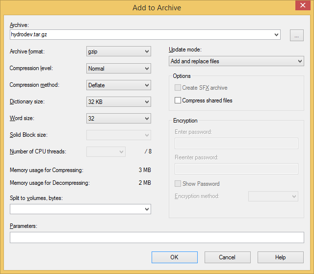
- The final result will be a file named **hydrodev.tar.gz** and is ready for distribution.

**OS X:** The _tar_ + _gzip_ process on OS X is a single command line call from terminal. Navigate to the Virtual Machines directory where the hydrodev folders are stored and issue the call.

	$ cd /Users/<username>/VirtualBox VMs/
	$ tar -zcvf hydrodev.tar.gz hydrodev

- The final result will be a file named **hydrodev.tar.gz** and is ready for distribution.