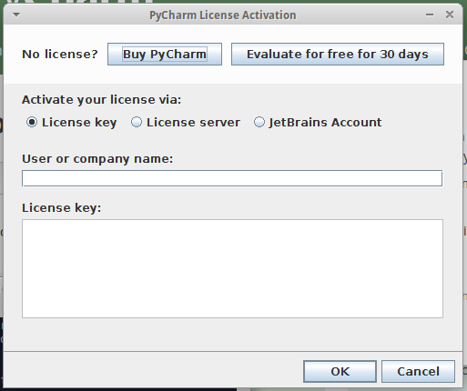

# README - hydrodev development VM

### PyCharm information

By default PyCharm Professional is installed on the hydrodev VM.

You should enter your license key for PyCharm by doing the following.

```
$ cd ~/pycharm-3.4.1/bin/
$ ./pycharm.sh
```

Then input your key information into the dialogue screen.




### Git information

Add your Git information to the VM

```
*** Please tell me who you are.

Run

  git config --global user.email "you@example.com"
  git config --global user.name "Your Name"

to set your account's default identity.
Omit --global to set the identity only in this repository.
```

Once input, verify your information with `git config --list`


## hydroshare repository

### Preferred Method - Local repository on Guest

From `/home/hydro/` clone the `hydroshare` repository.

`$ git clone https://github.com/hydroshare/hydroshare.git`

### Optional Method - Shared repository on Host

**On the Host**

From the VirtualBox application, create a Shared Folder entry

1. Choose _Settings > Shared Folders_
1. Select _Machine Folders_ and click the _Add_ icon
1. Set _Folder Path:_ to be the directory you wish to share on the Host
1. Set _Folder Name:_ to be **_hydroshare_**
1. Check the _Auto-mount_ checkbox

**On the Guest**

From `/home/hydro` perform the following

```
$ mkdir hydroshare
$ sudo chmod 777 hydroshare
$ sudo mount -t vboxsf hydroshare /home/hydro/hydroshare
```

## Miscellaneous

### Docker related

At times it is useful to purge all of the Docker images lying around your VM. To view which images are on your system, use `docker images`

```
# Stop all containers
$ docker stop $(docker ps -a -q)
# Delete all containers
$ docker rm $(docker ps -a -q)
# Delete all images
$ docker rmi $(docker images -q)
```

